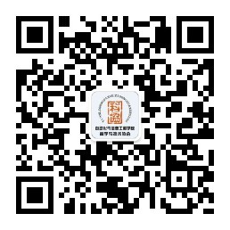

## 关于科协

　　自动化科协简介 自动化学院学生科协是我校最早创办的学生社团之一，现已成为直属于院团委的一个独立发展部门，成为我院学生科技工作中的一个重要组织。 协会以“发扬求是学风，弘扬科学精神，营造科技氛围，培养创新意识，为本院培养助研队伍，为企业输送优秀的人才”为宗旨。 协会自创办以来，本着“服务同学，培养同学科学思维方法及实际动手能力”的作风，培养了一批批具有较强动手能力的同学，也给同学们提供了大量切实的科技服务实践机会，如科技培训等。 科协承办的“理奥杯”科技展至今已成功举办了二十二届，对学校学生科技活动的促进起了很大的作用，并深受老师同学们一致好评，作品包括硬件软件以及科技论文。 科协的发展，离不开院里领导和团委的高度重视。老师们的关怀是我们科协不断进步的动力，我们也有自己的实验室，有各种实验仪器和开发工具。我们也相信科协能够越走越好。

## 意见&建议

　　西安理工大学-自动化与信息工程学院-科学与技术协会感谢各方对我协会的大力支持,如你有任何意见或者建议，请发送给我们发送邮件至管理员邮箱ke_xaut@163.com，或者点击这里留言。

## 通讯地址

<i class="fa fa-paper-plane fa-fw"></i>**Add:** 教五楼科协办公室

<i class="fa fa-phone fa-fw"></i>**Tel:** 029-82318560-8005

## 联系方式

<i class="fa fa-weixin fa-fw"></i>**微信：**扫描二维码关注微信平台

<i class="fa fa-envelope fa-fw"></i>邮箱:**官网邮箱:**xaut_auto_st@163.com
